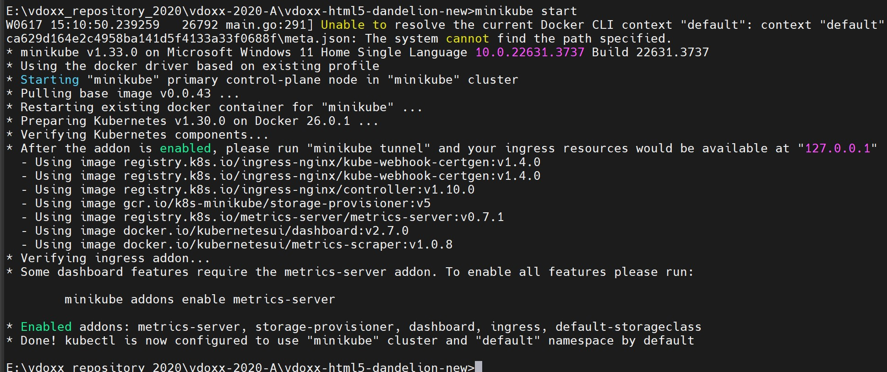
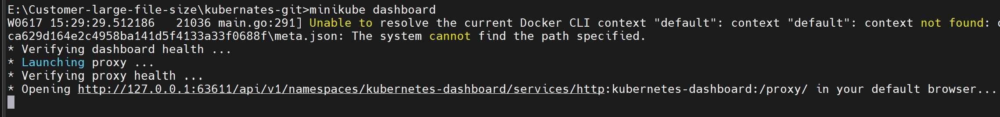
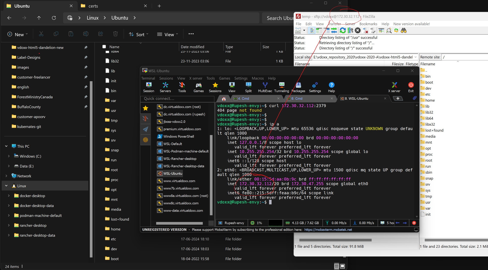

# cka
certified kubernates administrator


### How to start minikube cluster
```
minukube start
```



### What are alterrnatives of minikube
    Rancher, Openshift these are different skin of k8 cluster like AWS and Azure also give theirs. Minikube is by default provided by makers of k8. It's desktop version not advised to use in production. But it has mostly all production ready features.

### How to export current setting of kubectl

```
kubectl view config > config.yaml
```

### How to get minikube url to browse

```
minikube dashboard
```


### how to forward a port in k8 to localhost
kubectl port-forward pods/etcd-minikube 2379:2379

### How to install k8 minikube on Ubuntu

### How to install ssh on wsl-ubuntu
```
sudo apt-get install ssh
\\wsl.localhost\Ubuntu
```


### how to install etcd on ubuntu

```
sudo apt-get install etcd
```

### How to install podman in ubuntu
```
sudo apt-get -y install podman
```

### how to run minikube with podman
```
minikube config set rootless true
minikube start --driver=podman
```

### how to see all services of ubuntu
```
service --status-all
```


